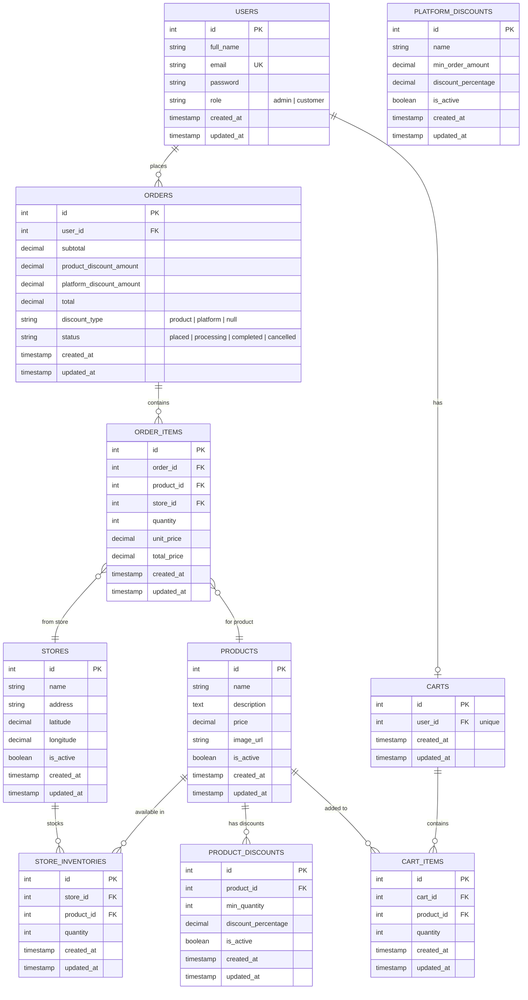
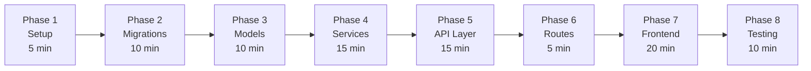
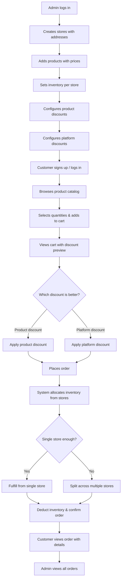
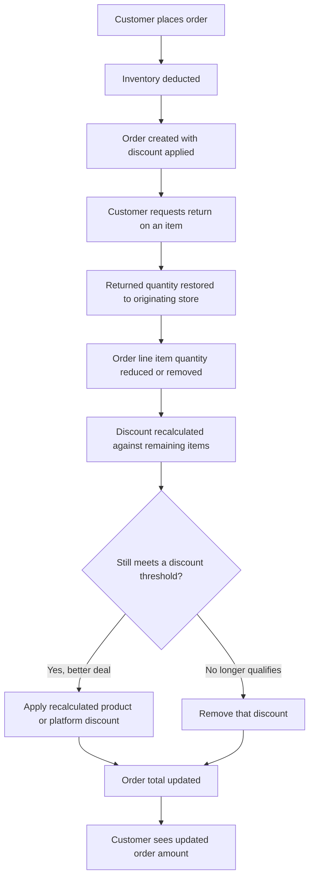

# 🏪 Multi-Store Ordering System — Implementation Plan

> **Tech Stack**: AdonisJS v6 + React 19 + Tailwind CSS v4 + PostgreSQL  
> **Time Budget**: ~1 hour 30 minutes  
> **Total Score**: 100 points

---

## 📊 Scoring Strategy

| Criteria | Points | Priority | Strategy |
|----------|--------|----------|----------|
| Project Completion | 30 | 🔴 Highest | Full working system end-to-end |
| Project Understanding | 20 | 🔴 High | Proper schema design, discount rules, inventory allocation |
| Completion Speed | 20 | 🟡 Medium | Parallel subagent builds, no wasted steps |
| Testing | 20 | 🟡 Medium | API tests + edge case coverage |
| UI/UX Presentation | 10 | 🟢 Lower | Clean Tailwind UI, responsive, good UX |

---

## 🗄️ Database Schema



---

## 🔧 Phase 1: Project Setup & Cleanup (5 min)

- [x] Rename `package.json` name → `multi-store-ordering`
- [x] Rename `.env` DB_DATABASE → `multi_store_ordering`
- [x] Create new PostgreSQL database `multi_store_ordering`
- [x] Delete `app/controllers/tasks_controller.ts`
- [x] Delete `app/models/task.ts`
- [ ] Remove task migrations (drop tables)
- [ ] Update `database/schema.ts` (remove TaskSchema)
- [ ] Add `role` column to User model

---

## 🔧 Phase 2: Database Migrations (10 min)

Create 10 migration files in `database/migrations/`:

| # | Migration | Key Columns |
|---|-----------|-------------|
| 1 | `create_stores_table` | name, address, lat/lng, is_active |
| 2 | `create_products_table` | name, description, price, image_url, is_active |
| 3 | `create_store_inventories_table` | store_id, product_id, quantity (unique: store+product) |
| 4 | `create_product_discounts_table` | product_id, min_quantity, discount_percentage, is_active |
| 5 | `create_platform_discounts_table` | name, min_order_amount, discount_percentage, is_active |
| 6 | `create_orders_table` | user_id, subtotal, discount amounts, total, discount_type, status |
| 7 | `create_order_items_table` | order_id, product_id, store_id, quantity, unit_price, total_price |
| 8 | `create_carts_table` | user_id (unique) |
| 9 | `create_cart_items_table` | cart_id, product_id, quantity (unique: cart+product) |
| 10 | `add_role_to_users_table` | role (string, default 'customer') |

---

## 🔧 Phase 3: Backend Models (10 min)

Create 9 models in `app/models/`:

| Model | Relationships |
|-------|--------------|
| `Store` | hasMany → StoreInventory |
| `Product` | hasMany → StoreInventory, ProductDiscount |
| `StoreInventory` | belongsTo → Store, Product |
| `ProductDiscount` | belongsTo → Product |
| `PlatformDiscount` | (standalone) |
| `Order` | belongsTo → User, hasMany → OrderItem |
| `OrderItem` | belongsTo → Order, Product, Store |
| `Cart` | belongsTo → User, hasMany → CartItem |
| `CartItem` | belongsTo → Cart, Product |

> [!NOTE]
> User model already exists. Only add `role` column declaration.

---

## 🔧 Phase 4: Business Logic Services (15 min)

### Inventory Allocation Service (`app/services/inventory_service.ts`)

```
Algorithm:
1. For each cart item (product + quantity):
   a. Query all stores with inventory for this product
   b. Sort by available quantity DESC
   c. If any single store has >= requested quantity → use that store
   d. If not → greedy split: take from store with most stock first, then next, etc.
   e. If total across all stores < requested → throw InsufficientInventoryError
2. Return allocation: { productId → [{ storeId, quantity }] }
```

### Discount Calculation Service (`app/services/discount_service.ts`)

```
Algorithm:
1. Calculate product-level discounts:
   - For each cart item, find active ProductDiscount where quantity >= min_quantity
   - If multiple match, use highest discount_percentage
   - Sum all product-level discount amounts
2. Calculate platform-level discount:
   - Find active PlatformDiscount where subtotal >= min_order_amount
   - If multiple match, use highest discount_percentage
   - Calculate platform discount amount
3. Compare totals:
   - If productDiscount > platformDiscount → apply product discount
   - Else → apply platform discount
   - NEVER combine both
4. Return { discountType, productDiscountAmount, platformDiscountAmount, finalTotal }
```

> [!IMPORTANT]
> Product-level and platform-level discounts **cannot** be combined. The system applies whichever gives the customer the better deal.

---

## 🔧 Phase 5: Validators & Controllers (15 min)

### Validators (`app/validators/`)

| File | Validators |
|------|-----------|
| `store.ts` | createStoreValidator, updateStoreValidator |
| `product.ts` | createProductValidator, updateProductValidator |
| `inventory.ts` | setInventoryValidator |
| `discount.ts` | createProductDiscountValidator, createPlatformDiscountValidator |
| `cart.ts` | addToCartValidator, updateCartItemValidator |

### Controllers (`app/controllers/`)

| Controller | Role | Endpoints |
|-----------|------|-----------|
| `stores_controller.ts` | Admin | CRUD stores |
| `products_controller.ts` | Admin + Customer | CRUD (admin) / List+View (customer) |
| `inventory_controller.ts` | Admin | Set/update inventory per store |
| `discounts_controller.ts` | Admin | CRUD product & platform discounts |
| `cart_controller.ts` | Customer | Add/update/remove items, view cart with discounts |
| `orders_controller.ts` | Customer + Admin | Place order, view orders, update status |

### Middleware

| Middleware | Purpose |
|-----------|---------|
| `admin_middleware.ts` | Check `user.role === 'admin'`, return 403 if not |

---

## 🔧 Phase 6: API Routes (5 min)

```
/api/v1/
├── auth/
│   ├── POST   /signup
│   └── POST   /login
├── account/
│   ├── GET    /profile
│   └── POST   /logout
├── admin/                          (auth + admin middleware)
│   ├── stores/         GET, POST
│   ├── stores/:id      GET, PUT, DELETE
│   ├── products/       GET, POST
│   ├── products/:id    GET, PUT, DELETE
│   ├── inventory/      GET, POST, PUT
│   ├── product-discounts/     GET, POST
│   ├── product-discounts/:id  PUT, DELETE
│   ├── platform-discounts/    GET, POST
│   ├── platform-discounts/:id PUT, DELETE
│   ├── orders/         GET
│   └── orders/:id      GET, PUT (status)
└── customer/                       (auth middleware)
    ├── products/       GET
    ├── products/:id    GET
    ├── cart/           GET, POST, DELETE
    ├── cart/items/:id  PUT, DELETE
    ├── orders/         GET, POST
    └── orders/:id      GET
```

---

## 🔧 Phase 7: Frontend — React Pages (20 min)

### Page Structure

```
resources/js/
├── app.tsx                          (entry point)
├── services/api.ts                  (API client — rewrite for new endpoints)
├── context/AuthContext.tsx           (auth state — keep, add role)
├── components/
│   ├── App.tsx                      (router — rewrite with new routes)
│   ├── Navbar.tsx                   (rewrite — admin/customer nav)
│   └── LandingPage.tsx              (rewrite — ordering system landing)
└── pages/
    ├── LoginPage.tsx                (keep — minor tweaks)
    ├── SignupPage.tsx               (keep — minor tweaks)
    ├── admin/
    │   ├── AdminDashboard.tsx       (overview stats)
    │   ├── StoresPage.tsx           (CRUD stores)
    │   ├── ProductsPage.tsx         (CRUD products)
    │   ├── InventoryPage.tsx        (manage inventory per store)
    │   ├── DiscountsPage.tsx        (product + platform discounts)
    │   └── AdminOrdersPage.tsx      (view all orders)
    └── customer/
        ├── ProductCatalog.tsx       (browse + add to cart)
        ├── CartPage.tsx             (view cart + discounts + checkout)
        └── OrdersPage.tsx           (order history + details)
```

### Key UI Features

| Page | Features |
|------|----------|
| **Landing** | Hero, feature highlights, CTA to login/signup |
| **Admin Dashboard** | Stats cards (stores, products, orders, revenue) |
| **Stores CRUD** | Table with add/edit/delete, address + coordinates |
| **Products CRUD** | Card grid, price, image URL, active toggle |
| **Inventory** | Matrix view: stores × products, editable quantities |
| **Discounts** | Two sections: product discounts + platform discounts |
| **Admin Orders** | Table with status badges, detail modal |
| **Product Catalog** | Card grid, quantity selector, "Add to Cart" |
| **Cart** | Item list, quantity edit, discount preview, "Place Order" |
| **Order History** | List with expandable details, store allocation info |

---

## 🔧 Phase 8: Testing (10 min)

### Functional Tests (`tests/functional/`)

| Test File | What it tests |
|-----------|--------------|
| `auth.spec.ts` | Signup, login, profile, logout |
| `stores.spec.ts` | Admin CRUD for stores |
| `products.spec.ts` | Admin CRUD for products |
| `inventory.spec.ts` | Setting/updating inventory |
| `discounts.spec.ts` | Product + platform discount CRUD |
| `cart.spec.ts` | Cart operations (add, update, remove, clear) |
| `orders.spec.ts` | Place order, inventory deduction, discount application |

### Edge Cases to Test

- [ ] Ordering more than available inventory → error
- [ ] Single-store vs multi-store fulfillment
- [ ] Product discount applied when quantity threshold met
- [ ] Platform discount applied when order amount threshold met
- [ ] Discounts NOT combined (only better one applied)
- [ ] Cart item quantity update to 0 → remove item
- [ ] Ordering with empty cart → error
- [ ] Non-admin accessing admin routes → 403
- [ ] Duplicate product in cart → update quantity instead of duplicate
- [ ] Inventory deducted correctly after order placed
- [ ] Order with products from multiple stores

---

## ⏱️ Time Allocation



> **Total: ~90 minutes** — matches the 1h30m budget

---

## 🚀 Expected Flow (End-to-End)



---

> [!CAUTION]
> **Key Constraints to Remember:**
> 1. Product + Platform discounts are **mutually exclusive** — apply only the better one
> 2. Inventory allocation **prefers single-store** fulfillment
> 3. Multi-store split uses **greedy algorithm** (most stock first), now **distance-aware** when customer coordinates are known (nearest store with sufficient stock wins)
> 4. Inventory **must be deducted** after order is placed
> 5. All admin routes require **role check middleware**

---

## 🔄 Change Request: Product Returns

### 1. Product Return

- Customer can return products from an existing order.
- Returned quantity should be added back to the store inventory.
- The returned quantity should be restored to the **store from which it was fulfilled** (per `order_items.store_id`, not just "any store").

### 2. Discount Recalculation

- After a return, the order should recalculate its applicable discount.
- If the remaining quantity no longer satisfies a product quantity discount, that discount should no longer apply.
- If the remaining order amount no longer satisfies the platform discount condition, that discount should no longer apply.
- Product-level and platform-level discounts must continue to remain mutually exclusive (reuse `DiscountService.calculate()` against the post-return line items).

### 3. Order Update

- Customer should be able to see the updated order amount after the return.
- The system should maintain the correct order and inventory state after the return (single DB transaction: adjust/remove `order_items`, restore `store_inventories.quantity`, recompute `orders.subtotal/productDiscountAmount/platformDiscountAmount/total/discountType`).

### Expected Flow



### Design Notes (not yet implemented)

| Area | Consideration |
|------|----------------|
| Data model | Needs a `returned_quantity` (or separate `order_item_returns` table) per `order_items` row to track partial returns without losing the original fulfillment record |
| Endpoint | Likely `POST /api/v1/customer/orders/:id/return` accepting `{ orderItemId, quantity }` |
| Inventory restore | Must credit `store_inventories` for the exact `store_id` on that `order_items` row (already tracked from the original allocation) |
| Discount recompute | Re-run `DiscountService.calculate()` using the post-return quantities/subtotal; do not simply prorate the original discount |
| Order status | Decide whether a full return cancels the order or only partial returns are allowed while `status` stays `completed`/`processing` |
| Validation | Reject returns exceeding the originally fulfilled quantity; reject returns on already-cancelled orders |
